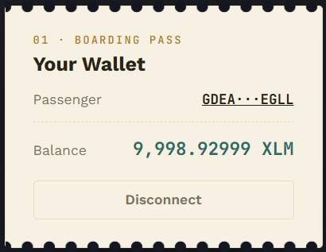
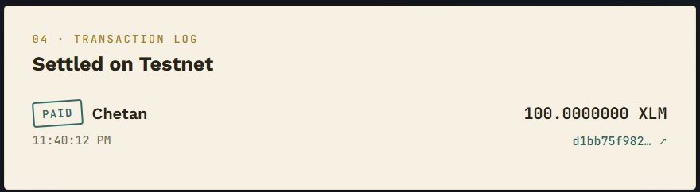

# 🎟️ Split the Bill — Stellar Testnet dApp

A ticket-and-receipt themed dApp for splitting a bill with friends and
settling everyone's share as a real XLM payment on the **Stellar Testnet**.
Built for **Level 1 — White Belt** of the Stellar Frontend Challenge.

**Live demo:** _add your deployed URL here (Vercel / Netlify / GitHub Pages)_

## What it does

1. Connect your **Freighter** wallet (Stellar Testnet).
2. See your XLM balance, and fund a fresh testnet account with one click
   (Friendbot) if it isn't funded yet.
3. Enter a bill total and optional tip %, then add the people splitting it
   by name + Stellar public address.
4. The app calculates each person's even share and lists it as a line item
   ("the tab").
5. Click **Pay share** next to any diner to build, sign (via Freighter),
   and submit a real XLM payment transaction to their address on testnet.
6. Every attempt — success or failure — is recorded in a transaction log
   with a status stamp, the amount, and a link to the transaction on
   [stellar.expert](https://stellar.expert/explorer/testnet).

> ⚠️ Testnet only. No real funds are ever used. All addresses, balances,
> and transactions in this app live on the Stellar test network.

## Tech stack

- [React 19](https://react.dev/) + TypeScript + [Vite](https://vitejs.dev/)
- [`@stellar/stellar-sdk`](https://github.com/stellar/js-stellar-sdk) —
  building/submitting payment transactions and reading balances from
  Horizon testnet
- [`@stellar/freighter-api`](https://github.com/stellar/freighter) —
  wallet connect/disconnect, network detection, and transaction signing
- Plain CSS (no framework) — a custom "ticket stub / receipt" design system

## Project structure

```
src/
  lib/
    stellar.ts       # Horizon testnet config, balance fetch, tx build/submit, Friendbot
    freighter.ts     # Freighter connect/disconnect/sign wrapper
  components/
    WalletPanel.tsx        # Connect/disconnect + balance ticket
    BillForm.tsx            # Total, tip %, add-diner form
    ParticipantLedger.tsx   # Per-diner share rows + "Pay share" action
    TransactionLog.tsx      # Stamped success/failure receipt log
  types.ts           # Shared Participant / TxRecord types
  App.tsx            # Wires state, wallet, and payment flow together
  index.css          # Design system (tokens, ticket cards, ledger rows)
```

## Setup instructions (run locally)

### Prerequisites

- [Node.js](https://nodejs.org/) 18+ and npm
- The [Freighter](https://www.freighter.app/) browser extension installed
- Freighter set to **Testnet** (Settings → Preferences → Network)

### Install & run

```bash
git clone https://github.com/<your-username>/<your-repo>.git
cd <your-repo>
npm install
npm run dev
```

Open the printed local URL (e.g. `http://localhost:5173`) in a browser
that has the Freighter extension installed.

### Build for production

```bash
npm run build
npm run preview
```

### Using the app

1. Click **Connect Freighter** and approve the connection request.
2. If your testnet account has no balance yet, click **Fund with
   Friendbot** — this requests free testnet XLM from Stellar's Friendbot
   service.
3. Enter a bill total (XLM) and, optionally, a tip percentage.
4. Add each diner's name and their Stellar testnet public address
   (`G...`, 56 characters). You can generate throwaway testnet keypairs
   at the [Stellar Laboratory](https://laboratory.stellar.org/) if you
   need test addresses to pay.
5. Click **Pay share** on a diner's row, approve the transaction in the
   Freighter popup, and watch the transaction log for the result.

## Requirements checklist (Level 1 — White Belt)

- [x] Freighter wallet setup on Stellar Testnet
- [x] Wallet connect functionality
- [x] Wallet disconnect functionality
- [x] Fetch connected wallet's XLM balance
- [x] Display balance clearly in the UI
- [x] Send an XLM transaction on Stellar testnet
- [x] Show transaction success/failure state
- [x] Show transaction hash / confirmation message

## Screenshots

> Replace these placeholders with real screenshots before submitting.
> Save images under `docs/screenshots/` and update the paths below.

**Wallet connected state**



**Balance displayed**


**Successful testnet transaction**




## Notes on error handling

- Invalid or malformed Stellar addresses are rejected before they can be
  added to the tab.
- If Freighter is on the wrong network, a warning banner explains how to
  switch, instead of silently failing on submit.
- Unfunded testnet accounts are detected (Horizon 404) and the UI offers
  a one-click Friendbot fund instead of showing a raw error.
- Every payment attempt is logged immediately as "pending" and updated to
  "success" (with tx hash) or "failed" (with the underlying error
  message) once Horizon responds.

## License

MIT — feel free to fork and adapt for your own challenge submission.
